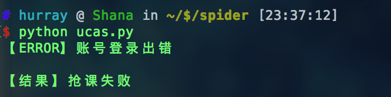
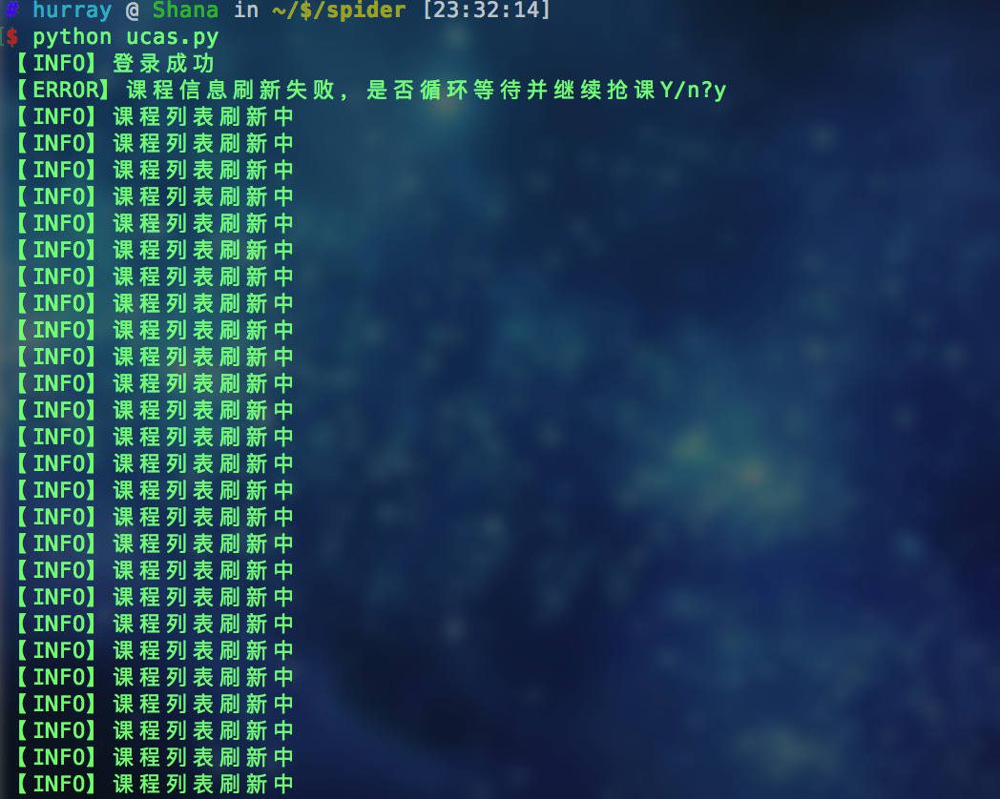
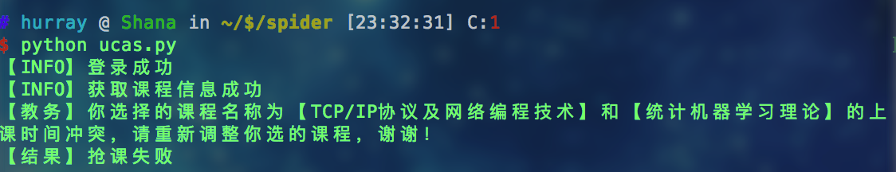

# UCAS GET Course
> 国科大抢课脚本
>
> >纪念那些年没有抢到的课

## 说明
### 环境
Python2.7

无第三方库，直接运行

**多线程暴力刷课**

### 关于

尽量把注释写的很清楚了，**如果教务有大改动的话不负责更新**，有小bug请随时发issue

### 使用
**需要填写的部分：**
```Python
username = ''  # 教务登录email
password = ''  # 教务登录password
course = [
        ('091M7010H', 0),
        ('091M7004H', 1),
    ]  # 需要抢课的课程号，格式('课程号', 学位课？)，1是学位课，0是非学位课
```

## 例图



